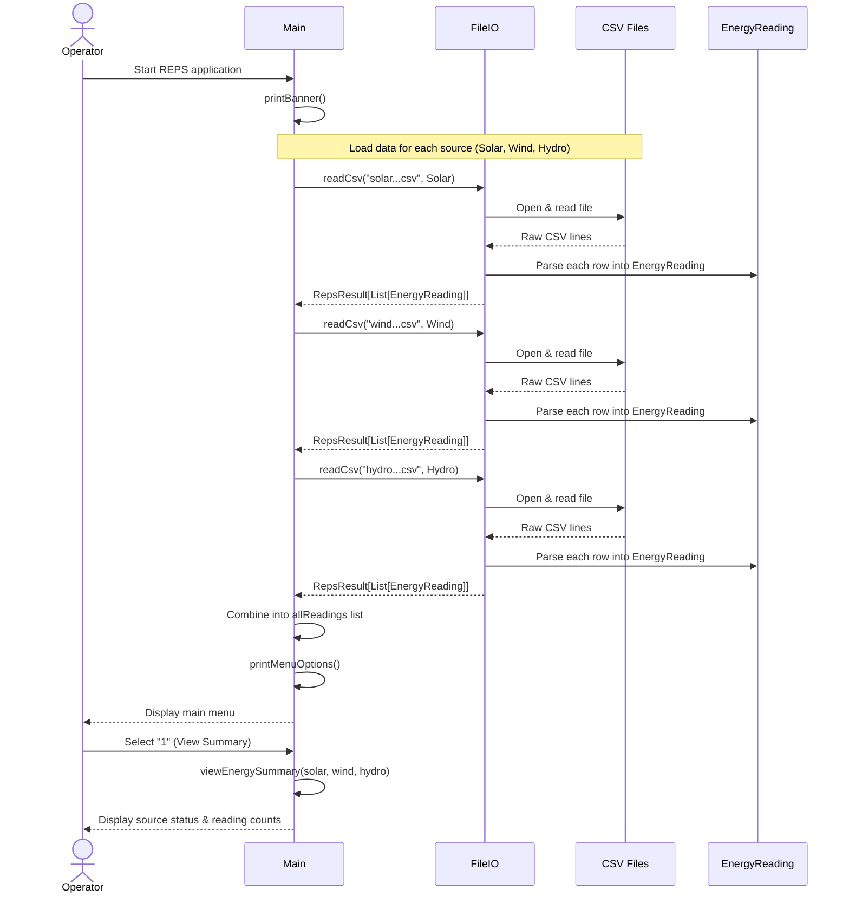
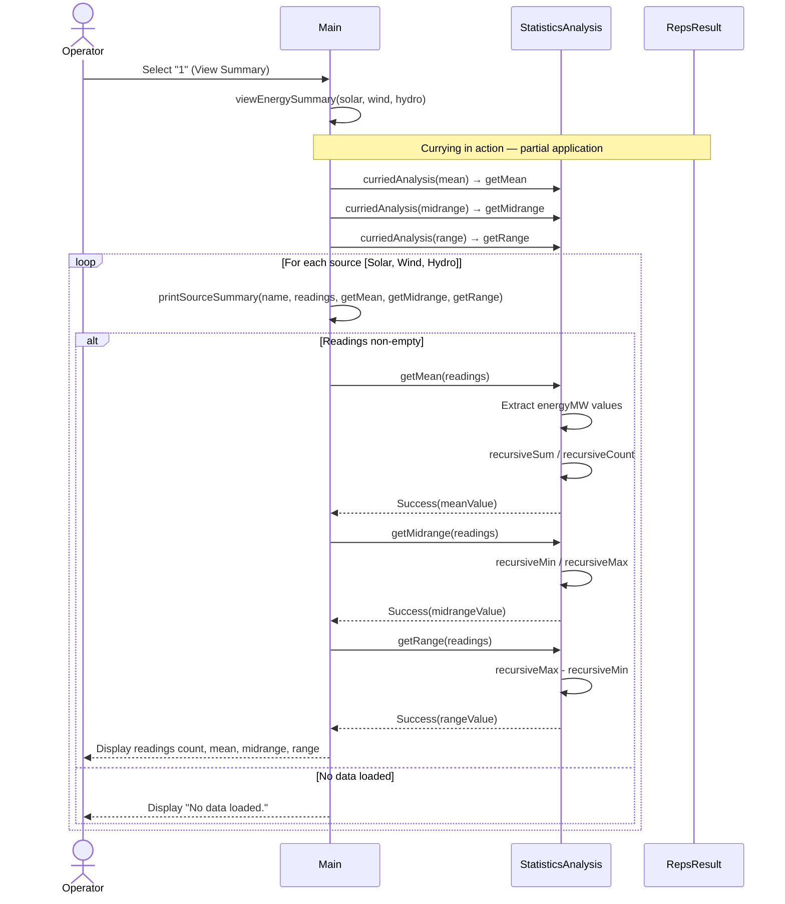
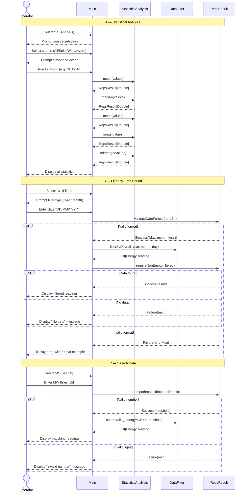
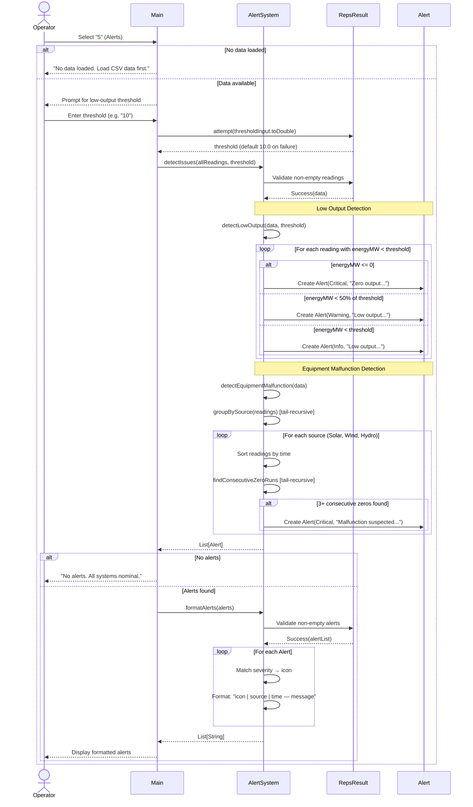
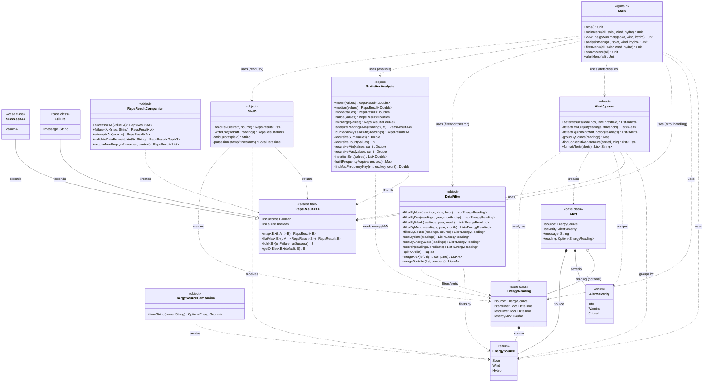

# REPS — Sequence & Class Diagrams (Mermaid)

> **Project:** Renewable Energy Plant System (REPS)  
> **Authors:** Mahi, Oyshe, Nguyen  
> **Tool:** Mermaid (paste into [mermaid.live](https://mermaid.live) to render & export)

---

## UC1 — Monitor & Control Energy Sources



---

## UC2 — Collect & Store Energy Data to File

```mermaid
sequenceDiagram
    actor Operator
    participant Main
    participant FileIO
    participant CSV as CSV Files
    participant RepsResult
    participant EnergyReading

    Note over Operator,EnergyReading: Reading data from CSV (collect)

    Operator->>Main: Start application
    Main->>FileIO: readCsv(filePath, source)
    FileIO->>CSV: scala.io.Source.fromFile(filePath)

    alt File exists
        CSV-->>FileIO: BufferedSource (lines iterator)
        FileIO->>FileIO: Skip header line
        loop For each data line
            FileIO->>FileIO: Split by ";" delimiter
            FileIO->>FileIO: stripQuotes(fields)
            FileIO->>FileIO: parseTimestamp(startTime, endTime)
            FileIO->>EnergyReading: Create EnergyReading(source, start, end, mw)
        end
        FileIO->>RepsResult: RepsResult.success(readings)
        RepsResult-->>Main: Success(List[EnergyReading])
    else File not found
        FileIO->>RepsResult: RepsResult.failure("File not found")
        RepsResult-->>Main: Failure(errorMsg)
        Main-->>Operator: Display warning message
    end

    Note over Operator,EnergyReading: Writing data to CSV (store)

    Main->>FileIO: writeCsv(filePath, readings)
    FileIO->>CSV: new PrintWriter(filePath)
    FileIO->>CSV: Write header line
    loop For each EnergyReading
        FileIO->>FileIO: Format timestamps to ISO-8601
        FileIO->>CSV: Write "startTime";"endTime";energyMW
    end
    FileIO->>RepsResult: RepsResult.success(())
    RepsResult-->>Main: Success(())
    Main-->>Operator: Confirm data stored
```

---

## UC3 — View Energy Generation & Storage Capacity



---

## UC4 — Analyze, Filter, Sort & Search Data



---

## UC5 — Detect Issues & Generate Alerts



---

## Class Diagram — Full System Architecture



---

## How to Render & Export

1. **Online:** Paste each code block into [mermaid.live](https://mermaid.live) → download as PNG/SVG.
2. **VS Code:** Install the *Mermaid Markdown* extension → preview diagrams inline.
3. **CLI:** Use `npx @mermaid-js/mermaid-cli mmdc -i diagram.md -o output.png`.
